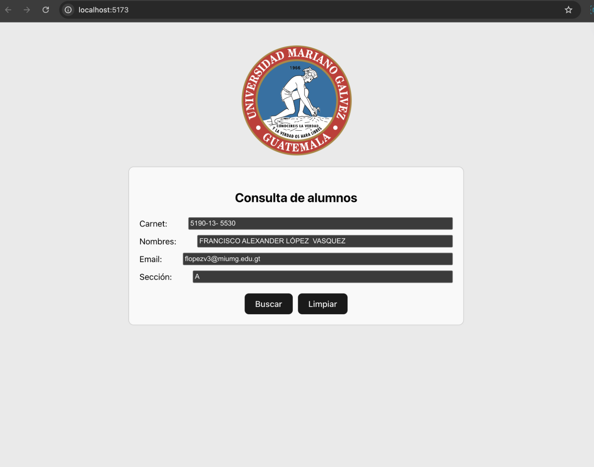

# Consulta de Alumnos - Proyecto Vite + React

Este proyecto es una aplicación web sencilla creada con Vite y React. La aplicación permite consultar la información de un estudiante ingresando su número de carnet. Realiza una solicitud GET a un API y muestra los datos del estudiante en el formulario.

## Estructura del Proyecto

- **src/App.js**: Archivo principal donde se renderiza el componente `ConsultaAlumnos`.
- **src/ConsultaAlumnos.js**: Componente principal que contiene el formulario y la lógica para consultar los datos del estudiante.

## Requisitos Previos

Antes de comenzar, asegúrate de tener instalados los siguientes requisitos en tu sistema:

- **Node.js** (versión 14 o superior)
- **npm** (versión 6 o superior)

## Instalación y Ejecución

Sigue los siguientes pasos para instalar y ejecutar el proyecto en tu máquina local:

1. **Clonar el repositorio:**

   ```bash
   git clone https://github.com/tu-usuario/consulta-alumnos.git
   ```

- Navegar al directorio del proyecto:

  ```bash
  cd consulta-alumnos

  ```

- Instalar las dependencias del proyecto:

  ```bash
  npm install

  ```

- Iniciar el servidor de desarrollo:

  ```bash
  npm run dev

  ```

- Iniciar el servidor de desarrollo:

  Visita la dirección que aparece en la terminal, típicamente http://localhost:5173.

## Uso del Componente `ConsultaAlumnos`

El componente `ConsultaAlumnos` es el corazón de esta aplicación. Proporciona una interfaz para que los usuarios puedan ingresar un carnet de estudiante y buscar la información correspondiente. A continuación se explica su funcionamiento:



### Funcionalidades Principales

- **Entrada de Carnet**: Un campo de entrada donde el usuario puede escribir el número de carnet del estudiante.

- **Botón "Buscar"**: Al hacer clic en este botón, se realiza una solicitud GET a la API para obtener la información del estudiante. La URL utilizada es `https://test-deploy-12.onrender.com/estudiantes/` seguida del carnet ingresado.

- **Mostrar Información**: Si la consulta es exitosa, los campos de nombres, correo electrónico y sección se rellenan automáticamente con los datos del estudiante.

- **Botón "Limpiar"**: Este botón permite restablecer todos los campos del formulario a valores vacíos.

### Cómo Funciona el Componente `ConsultaAlumnos`

El componente `ConsultaAlumnos` utiliza el hook `useState` de React para manejar los estados de los campos del formulario. Aquí te explico paso a paso cómo funciona:

#### Estados del Componente:

- **carnet**: Este estado almacena el valor ingresado por el usuario en el campo de carnet.
- **nombres, email, seccion**: Estos estados almacenan los datos recibidos de la API, como el nombre, correo electrónico y sección del estudiante, respectivamente.

#### Función `handleBuscar`:

- Se ejecuta cuando el usuario hace clic en el botón "Buscar".
- Utiliza `fetch` para realizar una solicitud GET a la API con el carnet ingresado como parte de la URL.
- Si la solicitud es exitosa (`response.ok`), convierte la respuesta en formato JSON y actualiza los estados `nombres`, `email` y `seccion` con la información recibida.
- Si no se encuentran datos para el carnet ingresado, se muestra una alerta al usuario.

#### Función `handleLimpiar`:

- Se ejecuta cuando el usuario hace clic en el botón "Limpiar".
- Restablece todos los campos del formulario (`carnet`, `nombres`, `email` y `seccion`) a valores vacíos.

#### Renderización:

- El formulario se renderiza con los campos de entrada y los botones "Buscar" y "Limpiar".
- El campo de carnet es editable por el usuario, mientras que los campos de nombres, correo electrónico y sección son de solo lectura y se llenan automáticamente después de una búsqueda exitosa.

```js
import React, { useState } from "react";

const ConsultaAlumnos = () => {
  const [carnet, setCarnet] = useState("");
  const [nombres, setNombres] = useState("");
  const [email, setEmail] = useState("");
  const [seccion, setSeccion] = useState("");

  const handleBuscar = async () => {
    try {
      const response = await fetch(
        `https://test-deploy-12.onrender.com/estudiantes/${carnet}`
      );
      if (!response.ok) {
        throw new Error("Error al obtener la data");
      }
      const data = await response.json();

      if (data.length > 0) {
        setNombres(data[0].Estudiante);
        setEmail(data[0].Email);
        setSeccion(data[0].Seccion);
      } else {
        alert("No se encontraron datos para este carnet");
      }
    } catch (error) {
      console.error("Error fetching data:", error);
    }
  };

  const handleLimpiar = () => {
    setCarnet("");
    setNombres("");
    setEmail("");
    setSeccion("");
  };

  return (
    <div
      style={{
        width: "600px",
        margin: "auto",
        padding: "20px",
        border: "1px solid #ccc",
        borderRadius: "10px",
        backgroundColor: "#f9f9f9",
        color: "black",
      }}
    >
      <h2>Consulta de alumnos</h2>
      <div className="field">
        <label>Carnet: </label>
        <input
          type="text"
          value={carnet}
          onChange={(e) => setCarnet(e.target.value)}
        />
      </div>
      <div className="field">
        <label>Nombres: </label>
        <input type="text" value={nombres} readOnly />
      </div>
      <div className="field">
        <label>Email: </label>
        <input type="text" value={email} readOnly />
      </div>
      <div className="field">
        <label>Sección: </label>
        <input type="text" value={seccion} readOnly />
      </div>
      <div style={{ marginTop: "20px" }}>
        <button onClick={handleBuscar}>Buscar</button>
        <button onClick={handleLimpiar} style={{ marginLeft: "10px" }}>
          Limpiar
        </button>
      </div>
    </div>
  );
};

export default ConsultaAlumnos;
```
